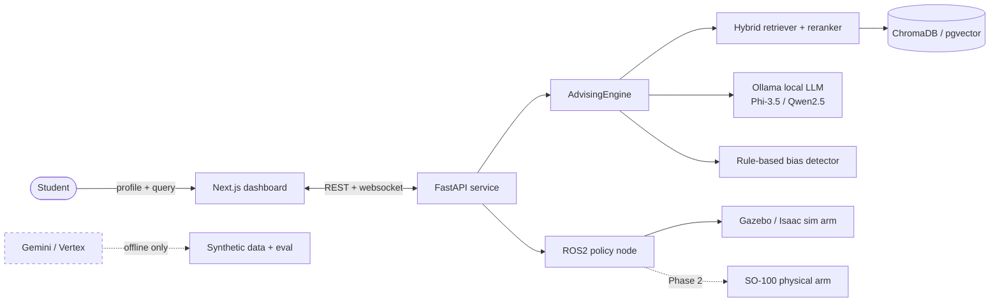
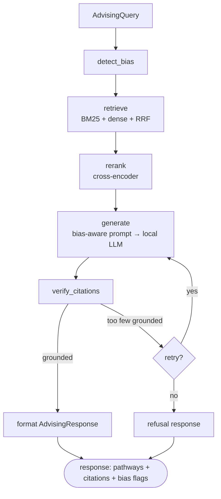
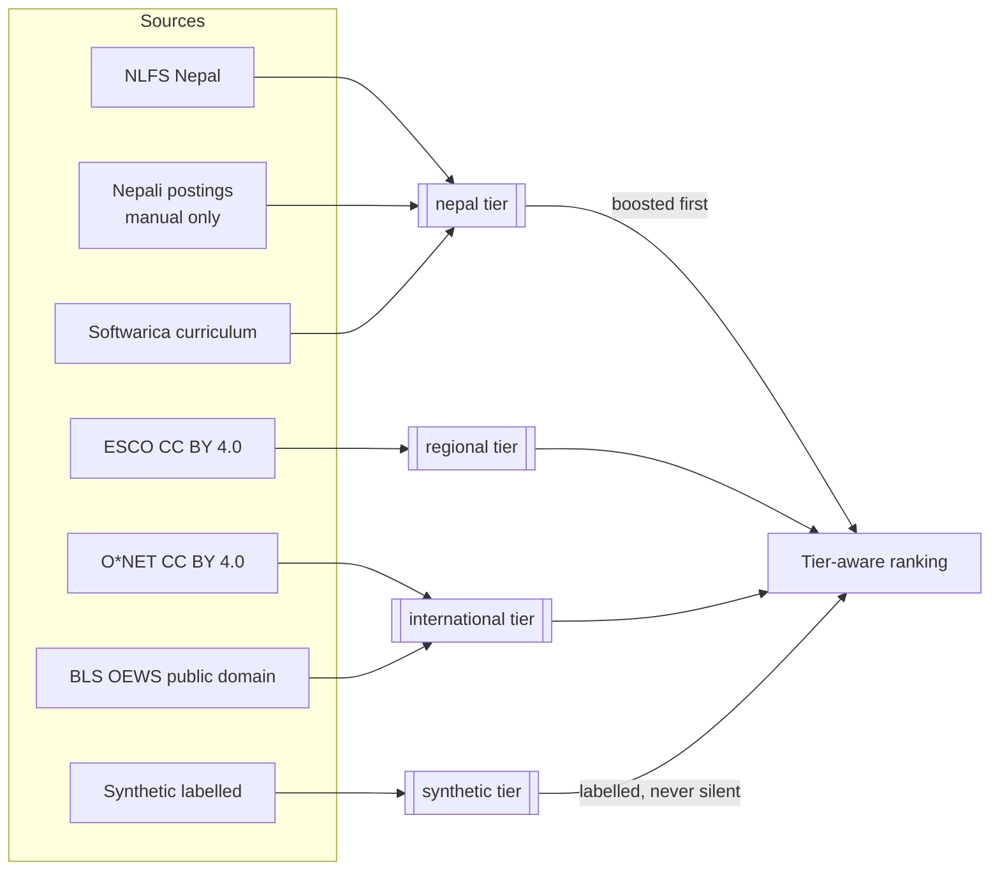
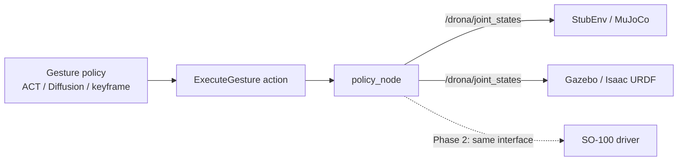

# D.R.O.N.A. System Architecture

**D**ynamic **R**obot for **O**rientation and **N**eed-based **A**dvising  
*BSc (Hons) Computing Final-Year Project — Softwarica College / Coventry University*

---

## Overview

D.R.O.N.A. is a socially assistive robot that guides computing students through career pathway decisions. A 6-DOF SO-100 arm performs expressive gestures while a RAG-based LLM advising engine, backed by Nepali job market data, generates personalised pathway recommendations.

The system is structured in two phases:

| Phase | Scope | Transport |
|-------|-------|-----------|
| **Phase 1** | Core logic — perception, advising, gesture control | In-process Python calls |
| **Phase 2** | ROS2 node deployment — real hardware, multi-process | ROS2 topics + services |

---

## Repository Layout

```
D.R.O.N.A/
├── drona/                   # Phase 1 Python library (all business logic)
│   ├── contracts.py         # Pydantic data contracts (single source of truth)
│   ├── advising/            # RAG + LLM advising pipeline
│   │   ├── engine.py        # AdvisingEngine — orchestrates retrieval → rerank → LLM
│   │   ├── retriever.py     # ChromaDB dual-collection retriever
│   │   ├── reranker.py      # Cross-encoder reranker
│   │   ├── bias_detector.py # Rule-based cognitive bias detector (C2)
│   │   ├── prompt_builder.py# System + user prompt construction
│   │   └── llm_client.py    # Ollama HTTP client wrapper
│   ├── perception/
│   │   └── mediapipe_detector.py # Engagement detection + StubDetector
│   ├── orchestrator/
│   │   ├── session_machine.py    # Finite state machine (IDLE→GREETING→…→IDLE)
│   │   └── orchestrator.py      # Tick loop coordinator
│   ├── interaction/
│   │   ├── demonstration.py     # Keyframe definitions + interpolation (C3)
│   │   ├── act_policy.py        # ACT policy + KeyframePolicy fallback
│   │   ├── gesture_dispatcher.py# Gesture execution engine
│   │   ├── mujoco_env.py        # MuJoCo env + StubEnv
│   │   ├── visualizer.py        # MuJoCo/Matplotlib arm visualizer
│   │   └── arm_interface.py     # Hardware abstraction (Sim ↔ SO-100 Dynamixel)
│   └── utils/
│       ├── settings.py          # Centralised configuration (pydantic-settings)
│       └── logging.py           # Loguru setup
├── ros2_ws/                 # Phase 2 ROS2 workspace
│   └── src/
│       ├── drona_msgs/      # Custom message + service definitions
│       ├── drona_ros/       # Four ROS2 nodes (thin transport wrappers)
│       └── drona_bringup/   # Launch files + YAML parameter files
├── scripts/
│   ├── ingest_data.py       # Populate ChromaDB from data/raw/
│   ├── train_act.py         # Train ACT gesture policies
│   ├── run_evaluation.py    # Evaluation harness (C1–C4)
│   └── run_simulation.py    # Full Phase 1 demo (no ROS2 required)
├── tests/                   # pytest suite (~300 tests)
├── data/
│   ├── raw/                 # Source documents (not committed — see data cards)
│   ├── processed/           # Chunked text ready for ChromaDB ingestion
│   ├── chromadb/            # Persistent ChromaDB store
│   ├── evaluation/          # Evaluation outputs and reports
│   └── cards/               # Dataset provenance cards (JSON)
└── docs/                    # This documentation
```

---

## Data Flow

```
Student speaks / approaches
        │
        ▼
┌─────────────────────┐
│  Perception Layer   │  MediaPipe face / body detection
│  (EngagementState)  │  → StudentDetection
└────────┬────────────┘
         │
         ▼
┌─────────────────────┐
│  SessionMachine     │  FSM: IDLE → GREETING → NEEDS_ASSESSMENT
│  (state machine)    │       → ADVISING → CLOSURE → IDLE
└────────┬────────────┘
         │ query_text
         ▼
┌─────────────────────────────────────────────────────────┐
│  AdvisingEngine                                         │
│  ┌──────────┐  ┌──────────┐  ┌────────────┐  ┌──────┐ │
│  │Retriever │→ │Reranker  │→ │BiasDetector│→ │  LLM │ │
│  │(ChromaDB)│  │(cross-enc│  │(rule-based)│  │(Ollama│ │
│  └──────────┘  └──────────┘  └────────────┘  └──────┘ │
│                                                         │
│  AdvisingResponse: pathways + bias_flags + speak_text   │
└────────┬────────────────────────────────────────────────┘
         │
         ▼
┌─────────────────────┐
│  GestureDispatcher  │  ACT policy / KeyframePolicy
│  → arm gestures     │  → joint trajectory → SO-100 arm
└─────────────────────┘
```

---

## Phase 2: ROS2 Node Graph

```
/drona/engagement          ← perception_node (10 Hz)
        │
        ▼
orchestrator_node ──────────────────────────────────────────┐
        │                                                    │
        │ /drona/student_query (String)                      │ /drona/gesture_command
        ▼                                                    ▼
advising_node                                        gesture_node
        │                                                    │
        │ /drona/advising_response                           │ /drona/joint_states (20 Hz)
        └────────────────────────────────────────────────────┘
```

All four nodes are **zero-logic wrappers** — they perform message translation only. Every algorithm lives in `drona.*` Phase 1 code.

---

## Key Design Decisions

### Zero-logic ROS2 nodes
Business logic lives in `drona.*`. The ROS2 layer is a thin transport shell using `msg_bridge.py` pure functions for Pydantic ↔ ROS2 message conversion. This enables full testing without ROS2 infrastructure.

### Nepal-first data tiering
`DataTier.NEPAL` citations always appear before `DataTier.INTERNATIONAL` in prompts. The retriever maintains two separate ChromaDB collections (`curriculum`, `career`) to allow independent quality control.

### Bias detection before generation
Cognitive bias flags are injected into the LLM system prompt as mitigation instructions before generation begins. The `BiasDetector` operates on rule-based keyword signals (no LLM call) to ensure low latency.

### Hardware abstraction
`BaseArmInterface → SimArmInterface / SO100ArmInterface` allows the gesture system to run identically in simulation and on the physical SO-100 arm, with a `make_arm_interface(use_hardware=True/False)` factory.

### Refusal over hallucination
If ChromaDB returns fewer than 2 citations above `min_citation_score`, the engine returns a `refusal=True` response rather than generating unsupported claims. This is a deliberate safety behaviour for a career advising context.

---

## Evaluation Contributions

| ID | Contribution | Method |
|----|-------------|--------|
| C1 | Retrieval quality (MRR@10, nDCG@10) | Relevance-graded query set against ChromaDB |
| C2 | Bias detection accuracy | Synthetic query set with known bias labels |
| C3 | Gesture smoothness (jerk score) | Joint trajectory analysis vs ACT baseline |
| C4 | Nepal citation ratio | Automated check of `DataTier.NEPAL` fraction in responses |

Run with: `python scripts/run_evaluation.py --c1 --c2 --c3 --c4`

---

## Diagrams (Mermaid)

### System context



### Advising request pipeline (LangGraph)



### Data provenance tiers (C4)



### Sim-to-real seam (C3)


